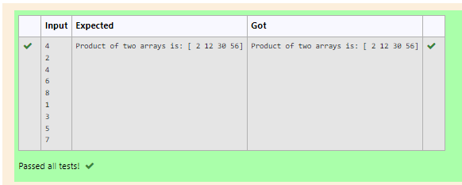

# Multiplying-two-matrix

## AIM:
To write a python program to Multiplying two arrays
## ALGORITHM:

### Step 1:
Import numpy as np.
### Step 2:
create an empty list.
### Step 3:
use append of the twp lists.
### Step 4:
Assign the arrays.
### Step 5:
In result multiply the assigned variables.
### Step 6:
Run the program.

## PROGRAM: 
```
import numpy as np
n=int(input())
v1,v2=[],[]
for i in range(n):
    v1.append(int(input()))
for i in range(n):
    v2.append(int(input()))
A=np.array(v1)   
B=np.array(v2)
result = A*B
print("Product of two arrays is:",result)
```

## OUTPUT:


## RESULT:
This program is executed successfully.


